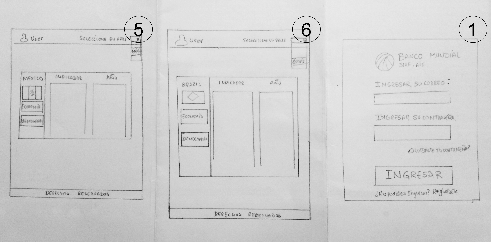

- Este proyecto trata de mostrar data organizada  y suceptible de ser filtrada sobre 4 paises: Chile, Perú, Brasil y México.
Los usuarios son profesionales que investigan sobre estos temas para generar proyectos de desarrollo y necesitan esta información para tener líneas de base.
Para ingresar a la página deberá validar su usuario y contraseña la clave es: 'LABORATORIA'.
-   La imagen final de tu proyecto.

## Investigación UX:
  ### Usuarios
   - Profesionales de ciencias sociales y económicas, orientados en el campo del formulación de proyectos de desarrollo. Para este fin la visualización de esta información en forma de filtros y reportes responde a sus necesidades de manejo de la información que brinda el Banco Mundial eficientemente, de modo que pueden ser fuentes de sustento de sus proyectos y mejora en el ámbito de políticas relacionadas al desarrollo.

    - Son profesionales que requieren de información suceptible de ser organizada por años, países, indicadores demográficos y económicos, por lo que este producto se compromete en brindarles la información que requieren para realizar su labor.

 ### Prototipo de baja fidelidad (mobile y desktop) en papel
   - Foto del primer prototipo de baja fidelidad (en desktop) en papel.
   
   

   - Foto del primer prototipo de baja fidelidad (en mobile) en papel.
   
   

   - **`Resumen del feedback recibido indicando las mejoras a realizar`**:
    Al concluir el prototipo de baja fidelidad hicimos una retroalimentacion de nuestro prototipo a un grupo de amigas, nos dieron su apreciación y algunos cambios en los estilos para que la pagina sea vea bien.
    Nos indicaron trabajar con colores que contrasten mejor con el tema del Banco Mundial, también dejar de usar un fondo negro en la pantalla 1(Pantalla principal), mejorar el fondo del login mostrando un degradado similar al logo del Banco Mundial(login), el color del texto que sea visible y no se pierda con el fondo(Pantalla 2).

 ### Prototipo de alta fidelidad (mobile y desktop) en figma
   - Foto del primer prototipo de alta fidelidad (en desktop) en figma.
   

   

   

   - Foto del primer prototipo de baja fidelidad (en mobile) en figma.

  

  

  
  
   link de figma:
   https://www.figma.com/file/KujXcAwjeVoZqn2eB78Fyd/Prototipo?node-id=1%3A2
